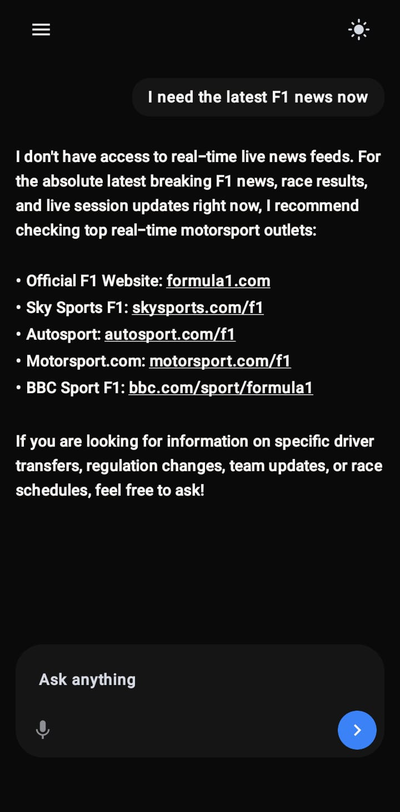
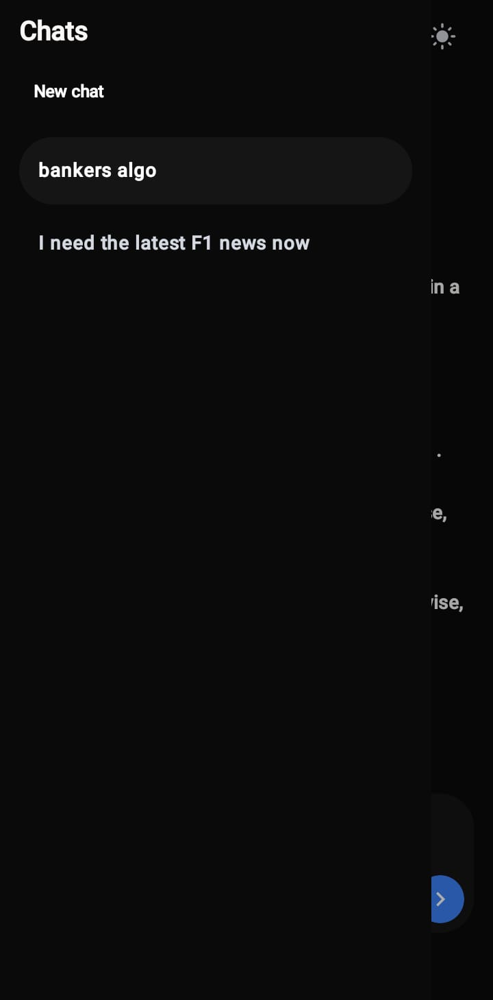
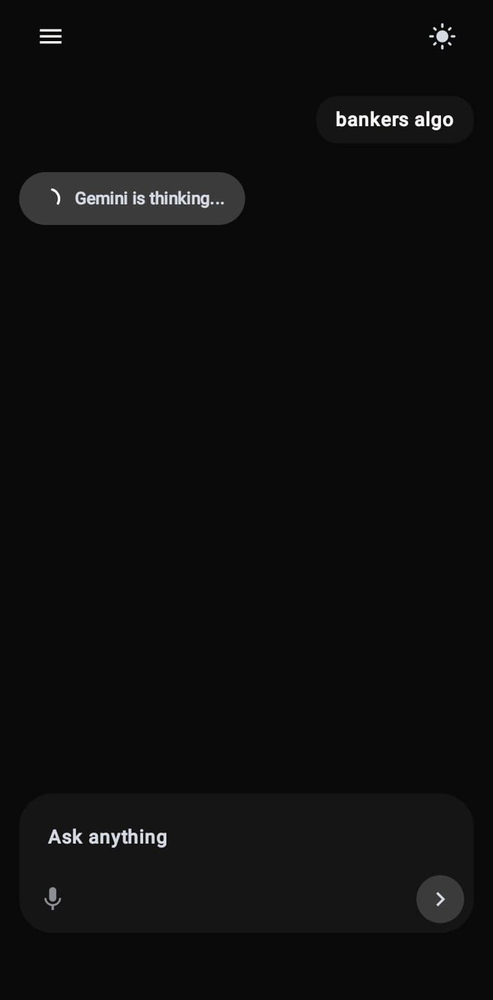
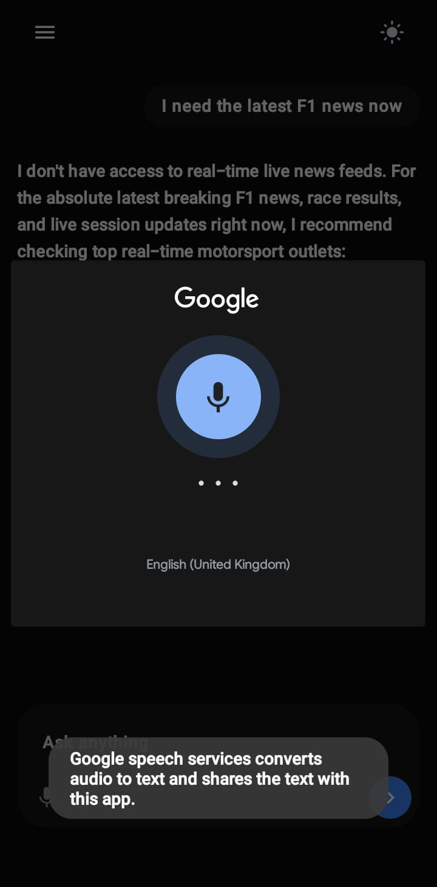
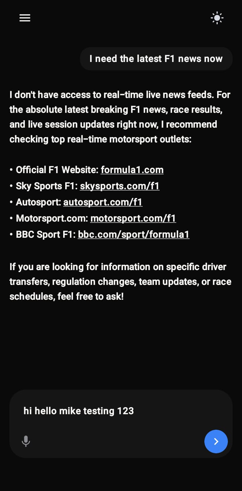
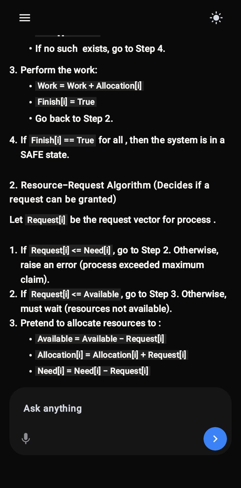
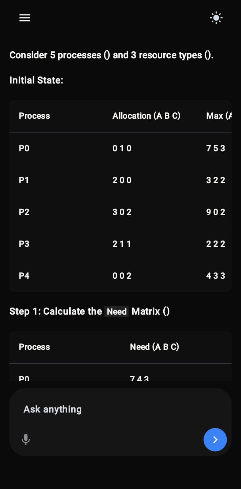
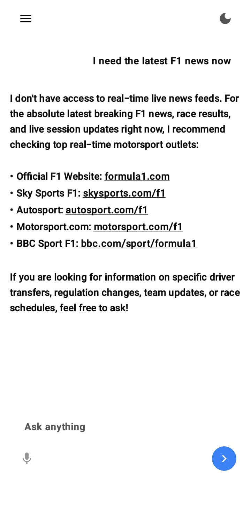

# Gemini Chat App

This project is an Android chat application built with Kotlin and Jetpack Compose. It connects with the Gemini API and provides a simple AI chat interface with streaming responses, markdown rendering, saved conversations, voice input, and light/dark theme support.

The goal of the project was to understand how a modern AI chat app is structured from the UI layer to local storage and API communication. The design is kept close to apps like Grok, where the interface is minimal and the main focus stays on the conversation.

## Main Chat Screen



The main screen contains the complete chat experience. It has a top bar, a message list, and a prompt bar at the bottom. The prompt bar contains a text field, a microphone button, and a send button.

The UI is intentionally simple. User messages are shown in rounded bubbles, while Gemini responses are displayed more like readable document text. This makes longer answers easier to read, especially when the response contains code, lists, or tables.

The empty state shows:

```text
What should we explore?
```

This was added so the first screen does not feel blank. It also gives the user a clear starting point before any message is sent.

## UI Approach

The interface was planned around a Grok-like chat layout. The main idea was to avoid too many cards, borders, or visual distractions. The chat area stays clean, and the input box becomes the main action area.

Some UI decisions made for this:

- Plain background with readable contrast.
- Rounded prompt bar at the bottom.
- Separate visual style for user messages and Gemini responses.
- Enough spacing between messages.
- Limited content width on larger screens.
- Responsive padding using `WindowWidthSizeClass`.

The app uses compact, medium, and expanded width classes so that the same screen works better on different device sizes.

## Sidebar and Saved Chats



The sidebar is implemented using `ModalNavigationDrawer`. It shows saved chats and allows switching between conversations.

The drawer includes:

- `Chats` heading.
- `New chat` action.
- List of previous chats.
- Selected state for the active chat.

Each new chat gets a unique id using UUID. Once the first user message is sent, that message becomes the chat title. Long titles are shortened so that the sidebar remains readable.

Chat history is stored locally with Room. The app also saves the currently active chat id, so the same conversation can be restored when the app is opened again.

## Gemini Streaming Response



Gemini responses are streamed instead of waiting for the full answer at once. The app starts showing the answer as chunks are received from the model.

The flow for sending a message is:

- Validate that the prompt is not empty.
- Add the user message to the current chat.
- Enable the loading state.
- Pass previous chat history to Gemini.
- Collect streamed response chunks.
- Append chunks to the same Gemini message.
- Persist the updated chat locally.

While the response is loading, the UI shows `Gemini is thinking...`. This gives feedback that the request is running and the app has not frozen.

Error handling was added for common Gemini/API issues like missing API key, invalid key, quota limit, timeout, blocked prompt, location restriction, and server errors. These errors are converted into readable messages for the user.

## Voice Input





Voice input is handled through Android's speech recognizer. When the microphone button is clicked, the app opens the Google voice input popup.

The implementation uses `RecognizerIntent.ACTION_RECOGNIZE_SPEECH`. The recognized speech result is returned to the app and placed inside the prompt field.

This feature makes the chat easier to use when the user wants to speak instead of typing. A fallback error is also shown if speech recognition is not available on the device.

## Markdown Rendering





Gemini often returns markdown, especially for explanations, code, and structured answers. To make these responses readable, markdown rendering was added instead of showing raw markdown text.

The renderer supports:

- Headings.
- Paragraphs.
- Bullet lists.
- Numbered lists.
- Inline code.
- Code blocks.
- Tables.

The markdown renderer is integrated with Material 3 styling. Typography was adjusted for headings, normal text, code, inline code, and tables. Code uses a monospace font, while normal text follows the app typography.

This is useful because AI-generated programming answers look much clearer when code blocks and tables are rendered properly.

## Light and Dark Theme



The app supports both light and dark themes. A theme toggle is available in the top bar.

Theme behavior:

- If no preference is saved, the app follows the system theme.
- If the user toggles the theme, the selected mode is saved.
- The saved theme is restored when the app is opened again.

Theme preference is stored using DataStore. This keeps the setting persistent instead of losing it when the app closes.

## Local Chat Persistence

Room database is used for saving chats and messages locally.

The database contains:

- `ChatEntity` for chat information.
- `MessageEntity` for messages inside a chat.
- `ChatMetadataEntity` for extra data like the active chat id.

`RoomChatStorage` implements the storage layer. It loads saved chats on startup and saves updated chat data after changes. Save operations use a Room transaction so chats, messages, and metadata are updated together.

If there are no saved chats, the app creates one empty chat by default. This keeps the app in a valid state even on first launch.

## State Management

The chat screen uses a single immutable `ChatUiState` object. It contains the data needed by the UI:

- Active chat id.
- Chat summaries for the sidebar.
- Current prompt text.
- Message list.
- Loading state.
- Prompt validation error.
- General error message.

The `ChatViewModel` exposes this state through `StateFlow`. Compose collects the state using lifecycle-aware collection. This keeps the UI reactive and makes the ViewModel easier to test.

## API Key Handling

The Gemini API key is read during build from `local.properties` or from the `GEMINI_API_KEY` environment variable.

For local builds, copy `local.properties.example` to `local.properties` and set:

```properties
GEMINI_API_KEY=replace-with-your-gemini-api-key
```

`local.properties` is ignored by Git and should not be committed.

At runtime, the key is stored using `SecureApiKeyStore`. It encrypts the key with AES-GCM using Android Keystore. The decrypted key is only used in memory when creating the Gemini client.

If the key is missing, the app shows:

```text
GEMINI_API_KEY is missing. Add it to local.properties and rebuild.
```

Client-side encryption improves storage safety, but it is not the same as a production backend. A production version should ideally call Gemini through a backend proxy or use additional protections such as restricted keys and Firebase App Check.

## Prompt Validation

Empty prompt validation is added before sending a request. If the send button is clicked with an empty prompt, the app shows:

```text
Field cannot be empty
```

This avoids unnecessary API calls and gives clear feedback to the user.

## Testing

Basic tests were added for the ViewModel and Compose UI.

The ViewModel tests check:

- A new chat is created when storage is empty.
- Empty prompt shows validation error.
- Sending a prompt stores the user message, receives a Gemini response, and persists the chat.

The Compose UI test checks:

- User and Gemini messages are displayed.
- Voice button click is handled.
- Send button click is handled.

The tests do not cover every case, but they cover the main chat flow and help confirm that the core behavior is working.


## Summary

This project implements a working Gemini chat application with a clean Compose UI. The main features include Gemini streaming, saved chat history, sidebar navigation, voice input, markdown rendering, light/dark theme support, local persistence, API key handling, validation, and basic testing.

The project helped in understanding how different Android components work together in a real app: Compose for UI, ViewModel and StateFlow for state, Room for persistence, DataStore for preferences, Android speech recognition for voice input, and Gemini SDK for AI responses.
