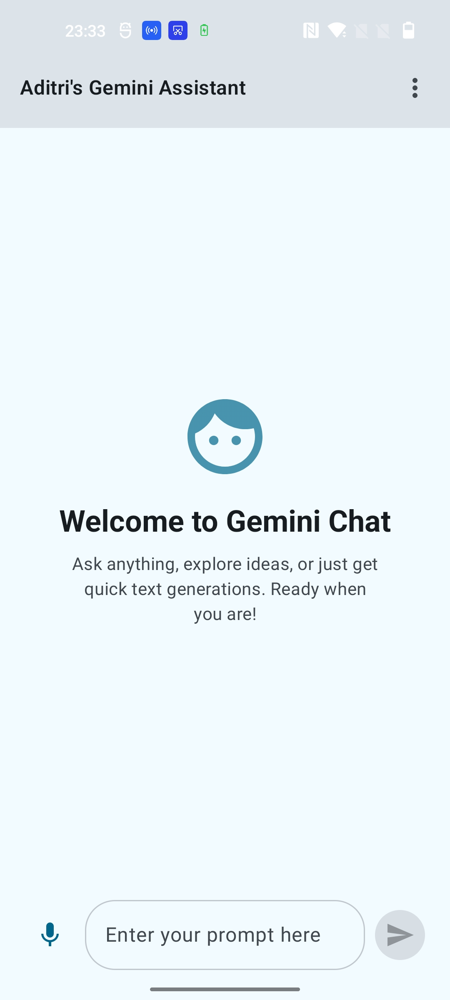
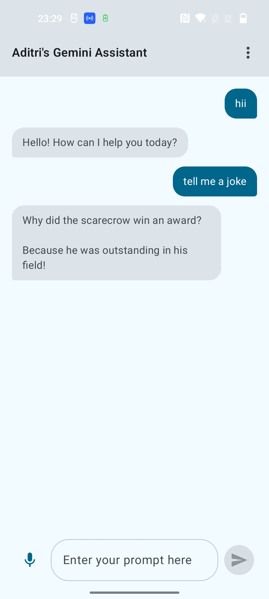
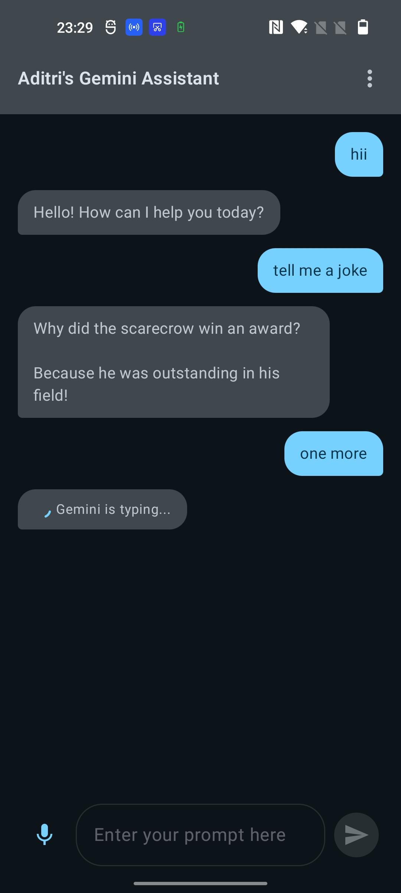
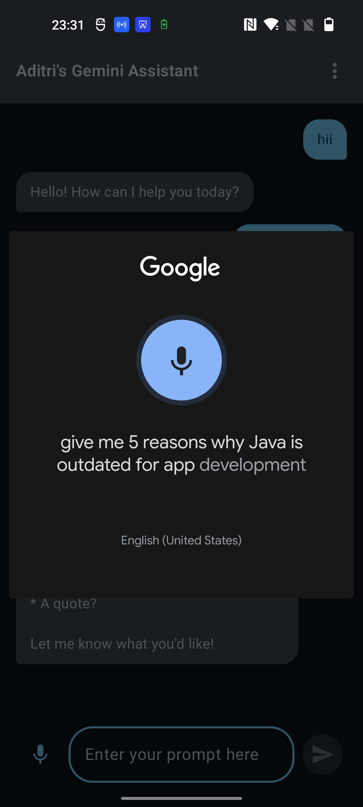
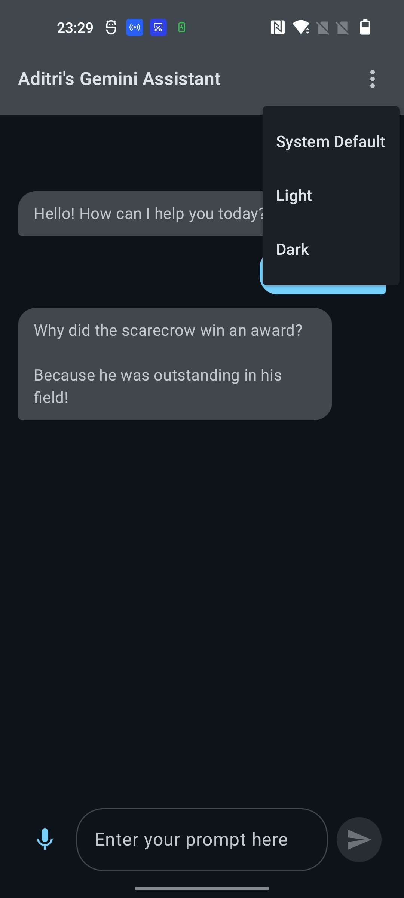
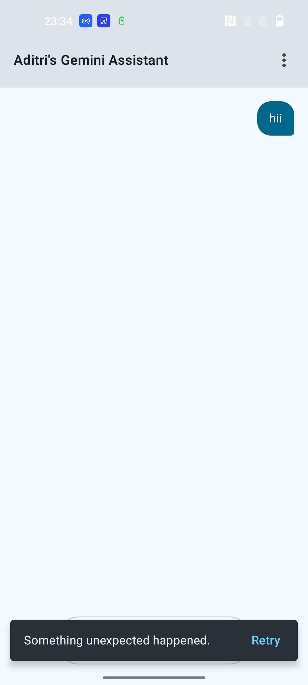
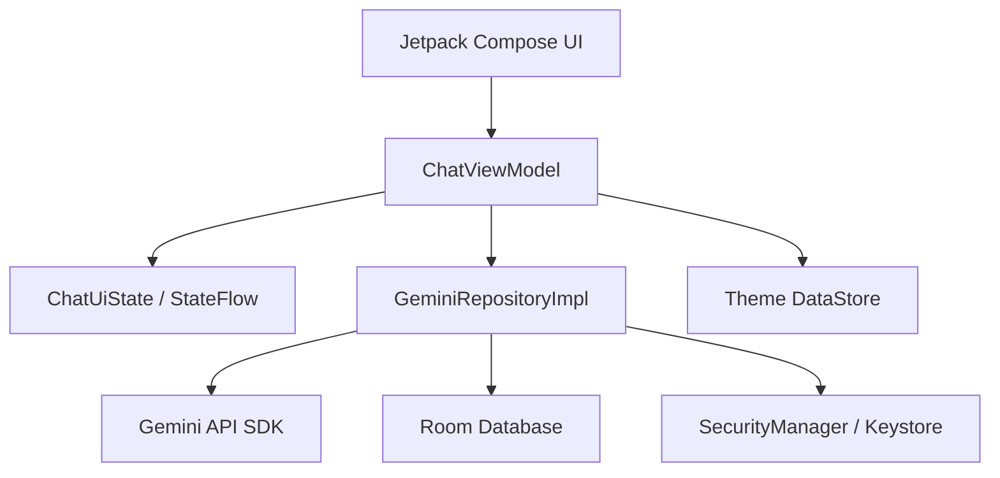

# Gemini AI Chat — Jetpack Compose Android Application

This project is an enhanced Gemini-powered Android chat application built using Kotlin and Jetpack Compose. It demonstrates modern Android development practices, including reactive UI, local persistence, hardware-backed security, and comprehensive testing.

## Assignment Overview

This project is an implementation of **Mobile Application Development Lab Assignment 1**, based on the Gemini Jetpack Compose starter application.

The main objectives achieved include:
*   **Enhanced Chat UI:** A polished Material 3 messaging interface.
*   **State Management:** Robust architecture using `ViewModel`, `StateFlow`, and `ChatUiState`.
*   **Adaptive Layouts:** Responsive design for various screen sizes and orientations.
*   **Voice Input:** Integrated speech-to-text functionality.
*   **Persistence:** Persistent theme preferences and conversational history.
*   **Security:** Multi-layered protection of the Gemini API key.
*   **Testing:** Automated unit and UI verification suites.

---

## Features Implemented

| Feature | Implementation | Status |
| :--- | :--- | :--- |
| **Gemini AI Chat** | Integrated via Google AI SDK (`gemini-1.5-flash`). | **COMPLETE** |
| **Material 3 UI** | Polished chat bubbles, TopAppBar, and Bottom Input Bar. | **COMPLETE** |
| **LazyColumn** | Optimized list for long conversations with stable keys. | **COMPLETE** |
| **Automatic Scrolling** | Autoscrolls to latest message on send/receive. | **COMPLETE** |
| **Empty/Welcome State** | Clean intro screen when no messages exist. | **COMPLETE** |
| **Loading Indicator** | Material 3 typing indicator while Gemini is thinking. | **COMPLETE** |
| **Error Handling** | Snackbar-based error reporting with **Retry** action. | **COMPLETE** |
| **Adaptive Layouts** | Max-width constraints on tablets/landscape modes. | **COMPLETE** |
| **Dark Mode** | Full system-aware dark theme & M3 Dynamic Colors. | **COMPLETE** |
| **Voice Input** | Integrated `RecognizerIntent` for speech-to-text. | **COMPLETE** |
| **Preferences DataStore** | Persists user theme choice (System/Light/Dark). | **COMPLETE** |
| **Room Database** | Full local persistence of chat history across restarts. | **COMPLETE** |
| **API Key Security** | **Android Keystore** + **AES-256-GCM** encryption at rest. | **COMPLETE** |
| **R8/Minification** | Obfuscation enabled for release builds. | **COMPLETE** |
| **Testing** | Comprehensive Unit and Compose UI test suites. | **COMPLETE** |

---

## UI Showcase

### Main Welcome Screen



> The initial state showing a polished welcome message and empty input.

### Chat Conversation



> Active dialogue showing User bubbles (right) and Gemini bubbles (left).

### Loading & Typing State



> The typing indicator displayed while the AI is generating a response.

### Voice Input (Speech-to-Text)



> Using system recognizer to populate the prompt field via speech.

### Dark Mode Support



> High-contrast Material 3 interface in Dark Theme.

### Error State & Retry



> Snackbar notification with a "Retry" button after a failed request.

---

## Technology Stack

*   **Language:** Kotlin
*   **UI Toolkit:** Jetpack Compose
*   **Theming:** Material 3 (including Dynamic Color)
*   **Concurrency:** Coroutines & Flow
*   **Persistence:** Room (SQL) & Preferences DataStore
*   **Security:** Android Keystore API (AES-256-GCM)
*   **Networking:** Gemini Generative AI SDK
*   **Dependency Injection:** Manual Factory Pattern (Constructor Injection)
*   **Testing:** JUnit 4, kotlinx-coroutines-test, Compose UI Test (JUnit4)

---

## Application Architecture

The app follows a strict **MVVM (Model-ViewModel-ViewModel)** architecture with a clean separation of concerns.



*   **UI Layer:** Composed of stateless composables that observe state and emit events.
*   **ViewModel:** Manages UI state, handles user intent, and orchestrates background work.
*   **Repository Layer:** Acts as the Single Source of Truth, coordinating between the Network (Gemini) and Local (Room) data sources.
*   **Security Layer:** Encapsulates Android Keystore operations to protect sensitive credentials.

---

## Message Flow

1.  **Input:** User enters text or uses **Voice Input**.
2.  **VM Action:** `ChatViewModel` receives text, clears input, and sets `isLoading = true`.
3.  **Local Save:** The User message is instantly saved to **Room** and appears in the `LazyColumn`.
4.  **Network Call:** `GeminiRepository` calls the Generative AI API on a background thread.
5.  **Persistence:** Upon success, the AI response is saved to **Room**.
6.  **UI Sync:** The UI (observing Room via Flow) automatically updates to show the new message.

---

## Data Persistence

### Preferences DataStore
User settings (specifically the **App Theme**) are stored using `androidx.datastore`. This ensures that if you set the app to "Dark Mode", it remains in Dark Mode even after a full device reboot.

### Room Database
Conversations are not lost when the app is closed. All messages are stored in a local SQLite database using **Room**. 
*   **Automatic Restore:** On startup, the ViewModel initializes a `Flow` that streams all previous messages from the database into the UI.

---

## API Key Security

This application implements a high-security approach to managing the Gemini API Key:

1.  **Zero hardcoding:** The key is never written directly in source code. It is read from `local.properties` (GIT-IGNORED) or a CI environment variable.
2.  **Encryption at Rest:** On the very first launch, the app generates a unique **AES-256-GCM** key inside the hardware-backed **Android Keystore**.
3.  **Encrypted Storage:** The Gemini API key is encrypted using that hardware key. Only the resulting **ciphertext** is saved to the device.
4.  **In-Memory Only:** The key is decrypted into memory only at the precise moment it is needed to initialize the AI model. It is never logged, toasted, or displayed.
5.  **Obfuscation:** R8 minification is enabled for release builds to prevent trivial extraction of string literals from the APK.

### Security Limitation
While this setup raises the bar significantly, no client-side secret is 100% safe from a determined attacker with physical access. For production apps, calls should be routed through a **Backend Proxy** or protected using **Firebase App Check**.

---

## Testing

### Unit Tests
*   **Path:** `app/src/test/java/.../ChatViewModelTest.kt`
*   **Scope:** Verifies the `ChatViewModel` logic using `Fake` repositories.
*   **Verifies:** Initial state, successful message flows, error handling, input validation, and retry logic.

### Compose UI Tests
*   **Path:** `app/src/androidTest/java/.../ChatUiTest.kt`
*   **Scope:** Verifies user-facing behaviors on a device/emulator.
*   **Verifies:** Rendering, user input, sending messages, display of chat bubbles, and Snackbar visibility.

---

## Testing Instructions

### Run Unit Tests
```bash
./gradlew :app:testDebugUnitTest
```

### Run UI Tests (Requires connected device)
```bash
./gradlew :app:connectedDebugAndroidTest
```

---

## Screenshot Instructions
Create a `screenshots/` directory in the repository root and place your rendered screenshots there using the following filenames:
* `main-chat.jpg`
* `chat-conversation.jpg`
* `loading-state.jpg`
* `error-state.jpg`
* `voice-input.jpg`
* `dark-mode.jpg`

---

## Conclusion
This enhanced application demonstrates a production-ready implementation of a generative AI interface. By combining **Jetpack Compose** for a modern UI, **Room/DataStore** for reliable persistence, and **Android Keystore** for security, it provides a seamless and secure user experience that satisfies all requirements of the Lab Assignment.
