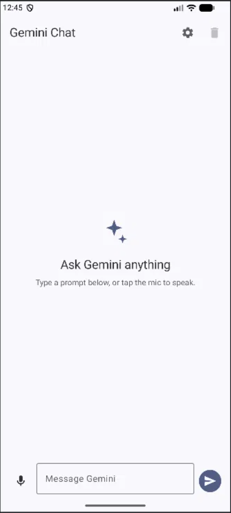
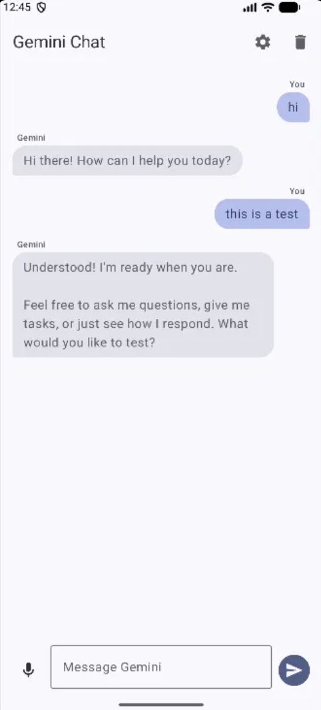
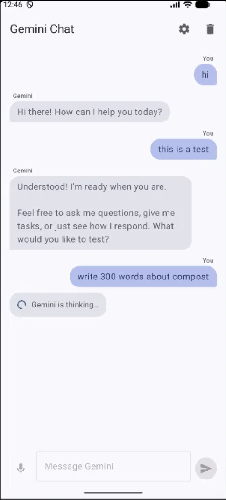
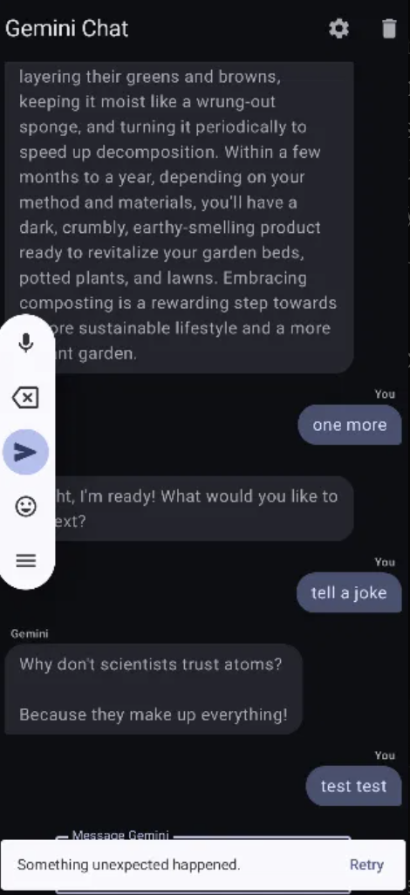
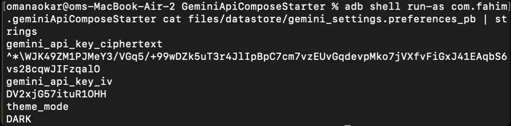

# Gemini Chat (Jetpack Compose)

A Compose chat client for the Gemini API, built on the course starter app. The single
prompt-and-response screen is now a real conversation: a `LazyColumn` of Material 3 bubbles,
voice input, history that survives restarts, and an API key that is encrypted at rest.

---

## 1. Setup

1. Get a key from [Google AI Studio](https://aistudio.google.com/app/apikey).
2. Copy `local.properties.example` to `local.properties` in the project root and fill it in:

   ```properties
   GEMINI_API_KEY=your_api_key_here
   ```

3. Sync and run. `local.properties` is git-ignored — do not commit it, and do not paste the
   key into a Kotlin file, `strings.xml` or `build.gradle.kts`.

If the key is missing the app still launches; the first send shows a snackbar telling you
what to add and where.

### Requirements

Android Studio with AGP 9, Gradle 9.1.0+, JDK 17, `minSdk` 26. Room's annotation
processing uses KSP 2.3.10, which is independent of the Kotlin version.

### Model choice

The app targets `gemini-2.5-flash`, set in `data/GeminiRepositoryImpl.kt`.

The starter pinned `gemini-3.6-flash`, which fails at runtime with this SDK. Responses from
3.x models include fields the client cannot parse — `thoughtSignature` on each part, and
`thoughtsTokenCount` and `serviceTier` in `usageMetadata` — none of which existed when
`com.google.ai.client.generativeai:generativeai:0.9.0` was written. The HTTP call returns 200
and deserialisation then throws, which surfaces as a request that spins and silently fails.
`gemini-2.5-flash` is contemporary with the SDK, emits no thought signatures, and costs far
fewer tokens per turn: "say hello in five words" used 354 thinking tokens on 3.6-flash for a
7-token answer.

### Fixes to the starter

Three defects in the upstream repository were fixed here:

- `gradle/wrapper/gradle-wrapper.jar` was not committed, so `./gradlew` could not run. The
  wrapper has been regenerated and `gradlew` committed with its executable bit set.
- `ChatScreen.kt` referenced `R.drawable.ic_assistant`, which did not exist in `res/drawable`,
  so the project did not compile as cloned. The drawable has been added.
- The pinned model was incompatible with the bundled SDK, as described above.

---

## 2. How the API key is protected

The key never exists as a string literal anywhere in the source tree.

```
local.properties  ──┐
                    ├─► build.gradle.kts ─► BuildConfig.GEMINI_API_KEY  (build-time seed)
env GEMINI_API_KEY ─┘                                   │
                                                        ▼
                                      first launch: AES-256-GCM encrypt
                                      key generated in Android Keystore
                                                        │
                                                        ▼
                              DataStore: ciphertext + IV only (no plaintext)
                                                        │
                              every later launch: decrypt in memory, once,
                              at the moment GenerativeModel is constructed
```

| Layer | Where | What it does |
|---|---|---|
| Not in VCS | `app/build.gradle.kts` | Reads `local.properties`, falls back to the `GEMINI_API_KEY` environment variable so CI uses a repository secret instead of a file. |
| Encrypted at rest | `data/crypto/KeystoreCipher.kt` | Generates an AES-256-GCM key via `KeyGenParameterSpec` inside the Android Keystore. The key material is created in, and never leaves, the Keystore — hardware backed where a TEE or StrongBox exists. |
| Ciphertext only | `data/ApiKeyStore.kt` | Persists Base64 ciphertext plus the GCM IV in DataStore. Decrypts in memory on demand; the plaintext is never logged, toasted or rendered. |
| Fails closed | `data/ApiKeyStore.kt` | If the Keystore entry is invalidated (app data cleared, device reset, backup restored elsewhere) decryption fails, the unreadable blob is dropped, and the app re-seeds. |
| No key in logs | `data/GeminiRepositoryImpl.kt` | Logs the exception class name only, never the message, which can echo request details. |
| Not in backups | `res/xml/backup_rules.xml`, `res/xml/data_extraction_rules.xml` | Excludes `datastore/` from cloud backup and device transfer. |
| Obfuscated | `app/build.gradle.kts` | `isMinifyEnabled = true`, so R8 obfuscates the release build. |
| CI guard | `.github/workflows/android.yml` | Fails the build if `local.properties` is tracked or an `AIza…` pattern appears in a tracked file. |

### What this does not do

Client-side encryption raises the cost of extraction; it does not make the key secret from a
determined attacker. Anything shipped to a device can be recovered from it — a rooted phone,
a hooked process (Frida), or a proxied TLS session all expose the key at the moment it is
used. R8 obfuscation renames symbols, it does not hide values.

A production app would not ship the key at all:

- **Backend proxy.** The app calls your server; the server holds the Gemini key and adds
  authentication, per-user rate limits and abuse logging. This is the only design that
  actually keeps the key secret.
- **Firebase App Check** to attest that requests come from a genuine build of your app.
- **Restricted keys** — API and application restrictions in Google Cloud — so a stolen key
  has a smaller blast radius.
- **Server-side rotation**, so revoking a leaked key does not need an app release.

---

## 3. What was built

### UI (Jetpack Compose, Material 3)

- **`LazyColumn` conversation** of user and Gemini bubbles with asymmetric corners, role
  labels, and stable `key`s plus `contentType` so Compose reuses items rather than rebuilding
  the list on every turn.
- **Auto-scroll** to the newest turn, including to the typing indicator.
- **State hoisting** — all state lives in `ChatUiState`, exposed as a `StateFlow` from
  `ChatViewModel` and collected with `collectAsStateWithLifecycle()`. Every composable below
  `ChatRoute` is stateless and takes callbacks.
- **Responsive layout** — `calculateWindowSizeClass` drives the breakpoint: full width on a
  phone; content capped at 720 dp and centred, with narrower bubbles, on tablets and in
  landscape. Previews are included for phone, phone-dark and tablet.
- **Loading and error states** — an inline `CircularProgressIndicator` in a typing bubble, and
  a `Snackbar` with a **Retry** action for failures. `ErrorEvent` carries an id so two
  identical failures are distinct values and the second one still shows.
- **Dark mode** — `isSystemInDarkTheme()` plus Material 3 dynamic colour on Android 12+, with
  an explicit system / light / dark override in the top bar.

### Functionality

- **Voice input** — mic button launches `RecognizerIntent.ACTION_RECOGNIZE_SPEECH` through
  `rememberLauncherForActivityResult`. It checks `SpeechRecognizer.isRecognitionAvailable`,
  requests `RECORD_AUDIO` at runtime, and appends the transcript to the prompt so the user can
  edit before sending. Unavailable recogniser and denied permission both surface as snackbars.
- **Persistent history** — Room (`messages` table) is the source of truth for the conversation.
  The DAO exposes a `Flow`, so a write re-renders the list; chats survive process death and
  app restarts. Clearing the conversation is one tap.
- **Remembered preferences** — theme mode and dynamic-colour choice are stored in Preferences
  DataStore and applied at the root of the Activity.
- **Multi-turn context** — prior turns are replayed via `startChat(history = …)`, capped at the
  20 most recent turns. Consecutive same-role turns are merged and a trailing user turn is
  dropped, so a retry after a failure cannot send Gemini a malformed alternation.

### Architecture

```
ui/chat     ChatRoute (stateful) → ChatScreen → bubbles, prompt bar   (Compose, stateless)
            ChatViewModel        → ChatUiState                        (StateFlow)
data        GeminiRepository  ChatHistoryRepository  UserPreferencesRepository   (interfaces)
            GeminiRepositoryImpl  RoomChatHistoryRepository  DataStore…Repository
            ApiKeyStore → crypto/KeystoreCipher
GeminiApp   AppContainer — hand-rolled DI, every dependency swappable for a fake
```

### Screenshots

| | |
|---|---|
|  |  |
| **Empty state** — placeholder before the first turn | **Conversation** — user and Gemini bubbles with role labels |
|  |  |
| **Loading** — typing bubble while the request is in flight | **Error** — snackbar with a Retry action |
|  |  |
| **Dark mode** — explicit override from the top bar | **Voice input** — system speech recogniser |


**Responsive layout** — landscape crosses into the Medium width class, so the conversation is
capped and centred and bubbles take a smaller share of the width.

### Encryption at rest, verified on device

```
$ adb shell run-as com.fahim.geminiApiComposeStarter \
    cat files/datastore/gemini_settings.preferences_pb | strings

gemini_api_key_ciphertext
^*\WJK49ZM1PJMeY3/VGq5/+99wDZk5uT3r4JlIpBpC7cm7vzEUvGqdevpMko7jVXfvFiGxJ41EAqbS6vs28cqwJIFzqalO
gemini_api_key_iv
DV2xjG57ituR1OHH
theme_mode
DARK
```



Only the ciphertext and the GCM IV are persisted. The plaintext key appears nowhere in the
app's private storage. `theme_mode` is stored in the clear alongside it, which is intended —
preferences are not secrets, and its presence confirms the dump is reading the real file.

---

## 4. Tests

```bash
./gradlew testDebugUnitTest                 # ChatViewModel, JVM only
./gradlew connectedDebugAndroidTest         # Compose UI tests, needs a device or emulator
```

**Unit tests** (`app/src/test`) — `ChatViewModel` against fake repositories, with
`StandardTestDispatcher` and `Dispatchers.setMain`. Covered: blank-prompt validation, the
happy path writing both turns, history excluding the turn being sent, failure keeping the user
turn and offering a retryable error, retry not duplicating the user turn, the missing-key error
being non-retryable, speech results appending to the prompt, clearing history, theme writes,
and repeated identical errors producing distinct events.

**Compose UI tests** (`app/src/androidTest`) — `createComposeRule()` against `ChatScreen` with
fixed state. Covered: both bubbles rendering, the empty-state placeholder, the progress
indicator and thinking label while loading, the validation message under the field, text input
reporting each change, and send and mic invoking their callbacks. Nodes without visible text
are found through `ChatTestTags`.

---

## 5. Performance notes

- Stable `key` and `contentType` on `LazyColumn` items; `@Immutable` on `ChatUiState`,
  `ChatMessage` and `UserPreferences` so Compose can skip unchanged bubbles.
- Theme preferences are collected from a separate `StateFlow`, so typing in the prompt field
  does not invalidate the tree at the root of the Activity.
- Callbacks are passed as method references rather than fresh lambdas per recomposition.
- All network work happens in `viewModelScope` on the SDK's own IO dispatcher; nothing blocks
  the main thread. The `GenerativeModel` is built once behind a `Mutex` and reused.
- History is capped at 20 turns, which bounds request size, token cost and latency.
- To verify: Layout Inspector → **Recomposition counts**, then type in the prompt field. Only
  the prompt bar should climb; bubbles should stay flat.
